# Md. Siam Parvez
### Full Stack Web Developer

Building scalable web applications and exploring AI.

  
  
  
  

---

## About Me

Full Stack Web Developer with experience building modern web applications using the MERN ecosystem. Currently focused on strengthening problem solving skills through Data Structures and Algorithms while exploring Artificial Intelligence and scalable software systems.

---

## Tech Stack

### Frontend

  

### Backend

  

### Authentication & UI

  

* Hero UI
* Better Auth
* JWT Authentication
* REST API Development
* Stripe Integration

---

## Current Focus

* Data Structures and Algorithms
* Problem Solving
* Competitive Programming
* Software Engineering
* Artificial Intelligence

---

## Featured Projects

### VitaFlow
Healthcare platform built using the MERN stack.

Live: https://vitaflow-client.vercel.app/

---

### HireLoop
Job platform connecting recruiters and job seekers.

Live: https://hireloop-client-beryl.vercel.app/

---

### PawsHome
Pet adoption platform designed to help pets find homes.

Live: https://pet-adoption-platform-a188.vercel.app/

---

## GitHub Statistics

  
  

---

## GitHub Trophies

  

---

## Contribution Graph

  

---

## Contribution Snake

  

---

### Thanks for visiting my profile.

